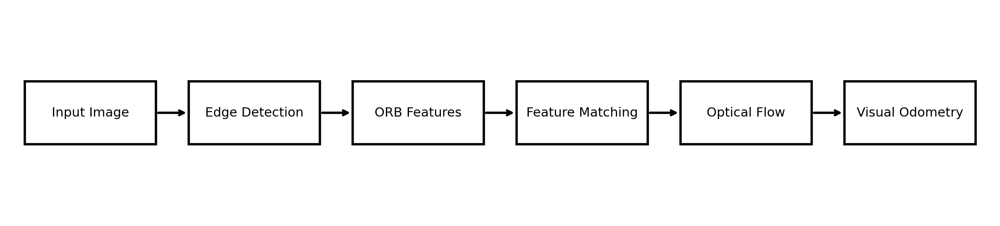
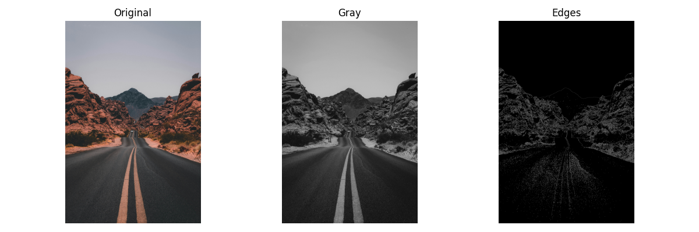
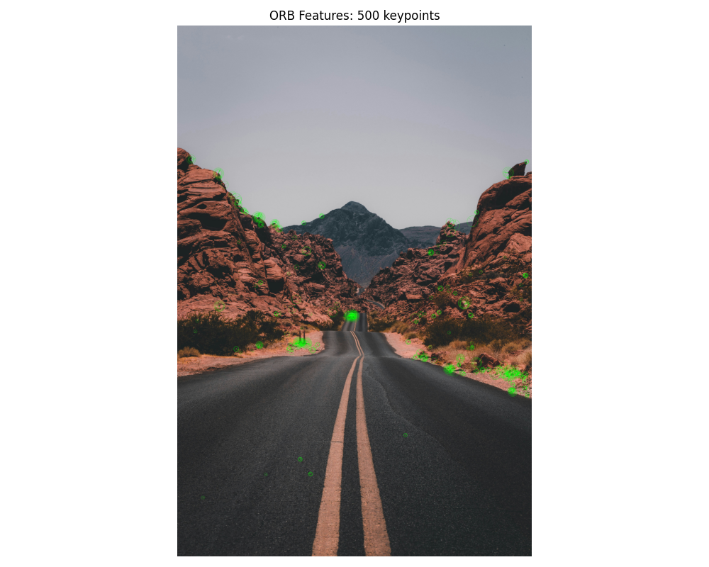
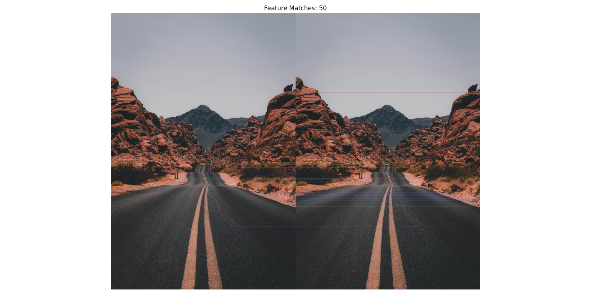
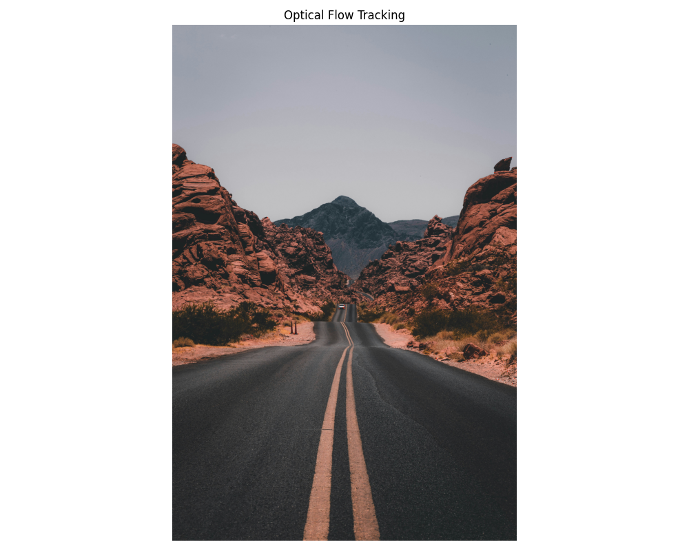
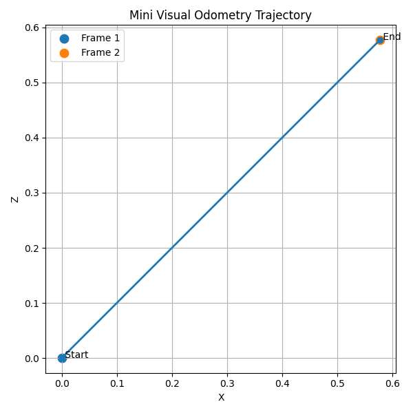

# UAV Vision Pipeline (CV Demo for UAV Applications)

A modular Computer Vision pipeline simulating core components of UAV perception systems, including edge detection, feature extraction, feature matching, optical flow tracking, and visual odometry.

---

## 📌 Project Overview

This project implements a simplified UAV visual perception pipeline:

```
Input Image
    ↓
Edge Detection (Canny)
    ↓
Feature Extraction (ORB)
    ↓
Feature Matching
    ↓
Optical Flow Tracking
    ↓
Visual Odometry (Pose Estimation)
```
## Pipeline Diagram



The goal is to demonstrate fundamental CV modules used in UAV navigation, SLAM, and autonomous perception.

---

## 📂 Project Structure

```
UAV-VISION
│
├── data/
│   └── images/
│       ├── drone.jpg
│       └── drone2.jpg
│
├── outputs/
│   ├── edge_detection_result.png
│   ├── orb_features_result.png
│   ├── feature_matching_result.png
│   └── optical_flow_result.png
│
├── src/
│   ├── detection/
│   ├── feature/
│   ├── matching/
│   ├── tracking/
│   ├── vo/
│   └── utils/
│
├── demo/
│   └── run_pipeline.py
│
├── README.md
└── requirements.txt
```

---

## 🧠 Modules Description

### 1. Edge Detection (Canny)

Detects structural boundaries in the scene.

* Highlights edges such as roads and terrain
* Useful for preprocessing and segmentation

---

### 2. ORB Feature Extraction

Detects keypoints and computes descriptors.

* Fast and efficient for real-time UAV systems
* Rotation and scale invariant

---

### 3. Feature Matching

Matches features between two frames.

* Uses BFMatcher (Hamming distance)
* Basis for motion estimation

---

### 4. Optical Flow Tracking

Tracks pixel motion between frames.

* Lucas-Kanade method
* Visualizes motion vectors

---

### 5. Mini Visual Odometry

Estimates camera motion between frames.

* Computes Essential Matrix
* Recovers rotation (R) and translation (t)

---

## 📊 Results

## Pipeline Diagram


---

### Edge Detection



---

### ORB Feature Extraction



---

### Feature Matching



---

### Optical Flow Tracking



---

### Mini Visual Odometry Trajectory



---

## ▶️ How to Run

### Install dependencies

```bash
pip install -r requirements.txt
```

---

### Run full pipeline

```bash
python demo/run_pipeline.py
```

---

### Run individual modules

```bash
python -m src.detection.edge_detection
python -m src.feature.orb_features
python -m src.matching.feature_matching
python -m src.tracking.optical_flow
python -m src.vo.mini_visual_odometry
```

---

## ⚙️ Key Technologies

* OpenCV
* NumPy
* Matplotlib
* ORB Feature Detector
* Optical Flow (Lucas-Kanade)
* Visual Odometry (Essential Matrix)

---

## 🚁 Application Scenarios

* UAV navigation
* Visual SLAM
* Autonomous inspection
* Motion estimation

---

## 📌 Future Improvements

* Multi-frame trajectory estimation
* Real dataset integration (KITTI / EuRoC)
* Deep learning-based feature extraction
* Real-time ROS2 integration

---

## 👨‍💻 Author

WANG Qianlin
UAV Systems

---
